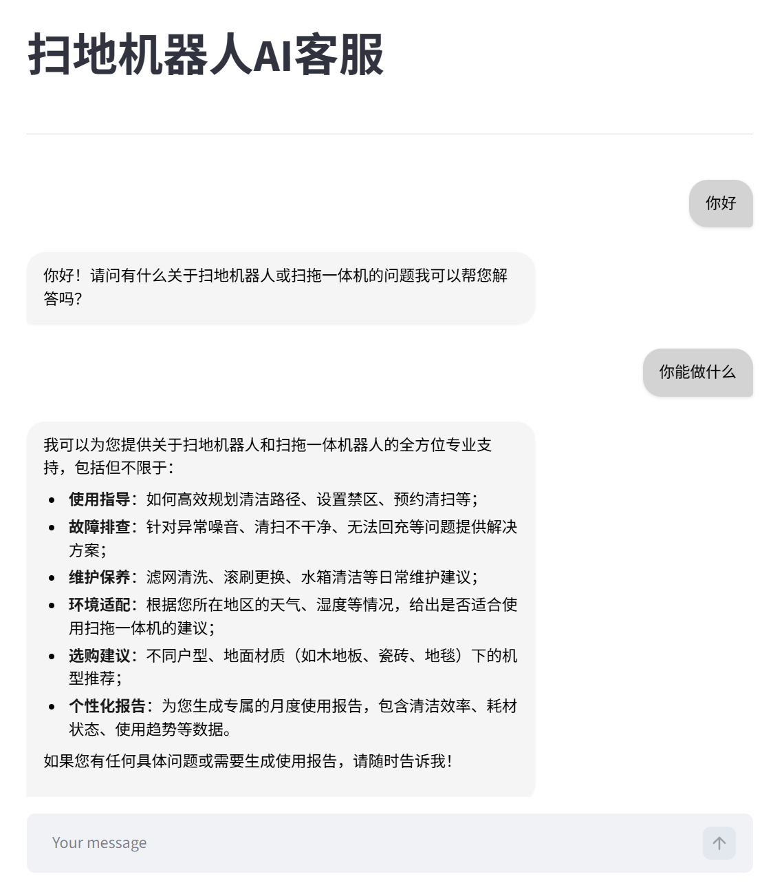
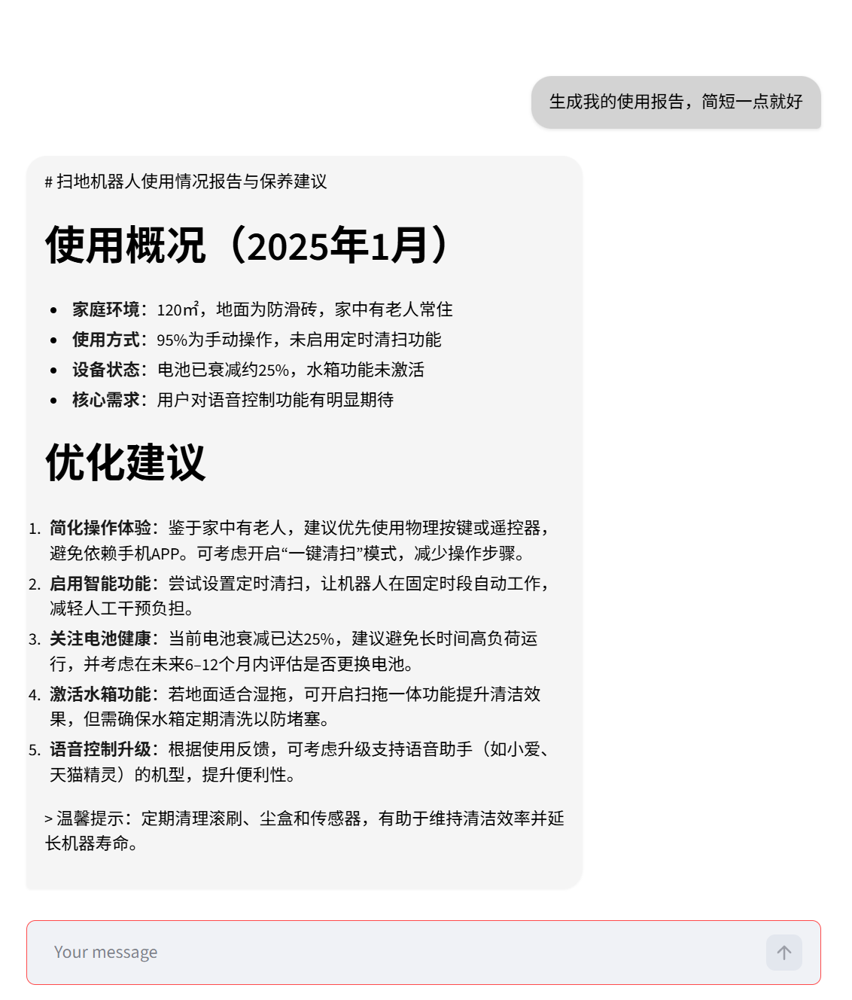
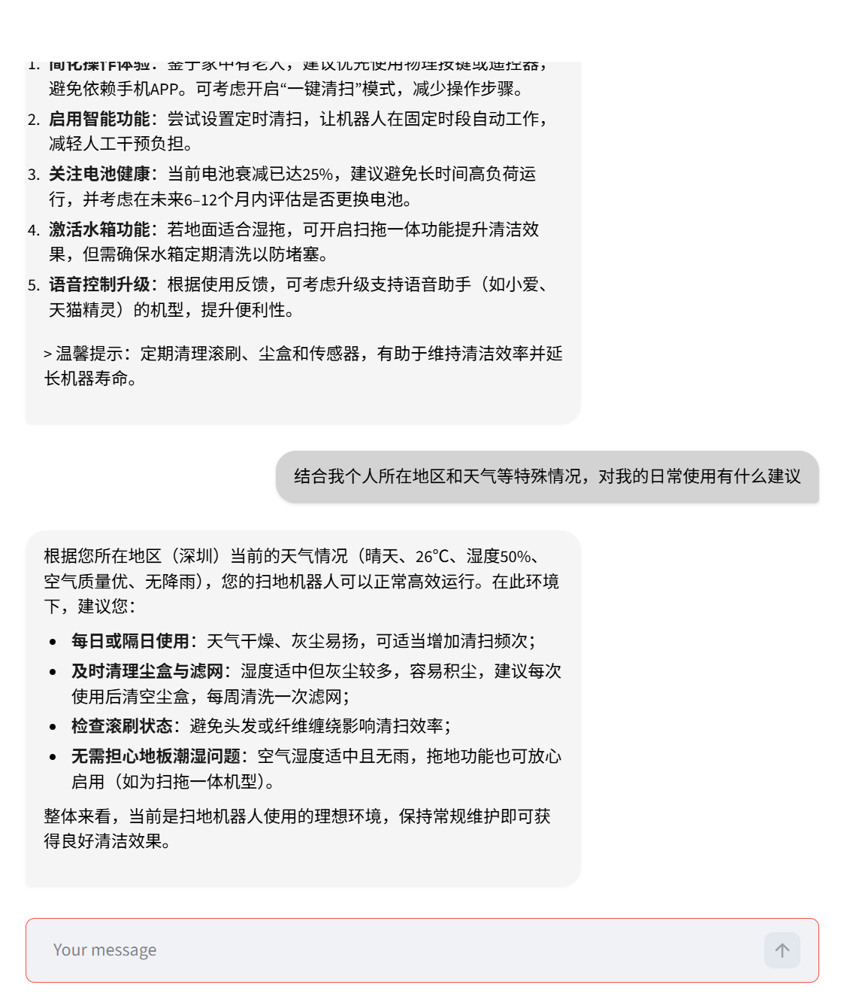

# AI 客服助手 - 扫地机器人

一个基于 LangChain ReAct + Chroma 向量库的智能客服系统。支持知识库检索（RAG）、动态提示词切换、报告生成等功能。

## 核心特性

- RAG 智能检索：向量化存储知识库，支持 TXT/PDF 等格式
- ReAct Agent：自动调用工具完成复杂任务
- 动态提示词切换：支持普通客服/报告生成模式切换
- 流式响应：实时流式输出提升用户体验

## 使用效果展示

**场景 1：普通客服问答**



**场景 2：报告生成模式**



**场景 3：工具调用过程**



## 项目结构

```
├── app.py                     # Streamlit 应用入口
├── agent/
│   ├── react_agent.py         # ReAct Agent 编排
│   └── tools/
│       ├── agent_tools.py     # 工具函数集
│       └── middleware.py      # 中间件处理
├── rag/
│   ├── rag_service.py         # RAG 检索服务
│   └── vector_store.py        # 向量库管理
├── model/factory.py           # 模型工厂
├── config/                    # 配置文件
├── prompts/                   # 提示词模板
├── data/                      # 知识库文件
└── utils/                     # 工具函数库
```

## 快速开始

**安装依赖**

```bash
pip install -r requirements.txt
```

**配置环境变量**

```bash
cp .env.example .env
# 编辑 .env，填入 DASHSCOPE_API_KEY
```


**启动应用**

```bash
streamlit run app.py
```

访问 `http://localhost:8501`

## 技术栈

| 组件 | 技术选择 | 用途 |
|------|-------|------|
| **Web UI** | Streamlit | 实时聊天界面 |
| **Agent 框架** | LangChain | 智能决策和工具调度 |
| **向量数据库** | Chroma | 知识库向量存储和检索 |
| **大模型** | 阿里通义千问 (DashScope) | 对话生成和向量化 |
| **文档处理** | LangChain + PyPDF | 支持 TXT、PDF 格式 |
| **配置管理** | PyYAML | YAML 配置文件解析 |

### 工作流程

```
用户输入 
   ↓
Agent 初始化（加载提示词、工具、中间件）
   ↓
LangChain Agent 推理
   ├─ 模型决策 → 是否需要调用工具？
   ├─ 工具调用 → 执行相应工具（RAG、天气、用户数据等）
   ├─ 中间件处理 → 记录日志、动态切换提示词
   └─ 模型生成回复
   ↓
流式返回结果到前端
```

## 许可证

MIT License
